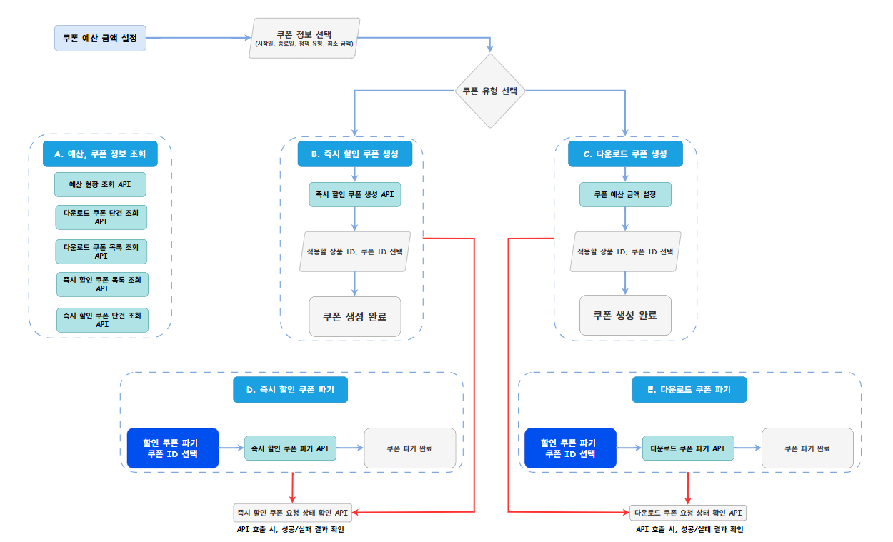
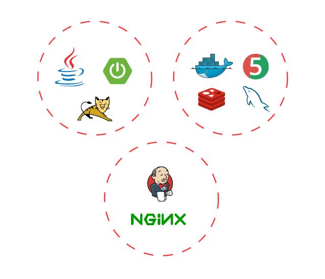
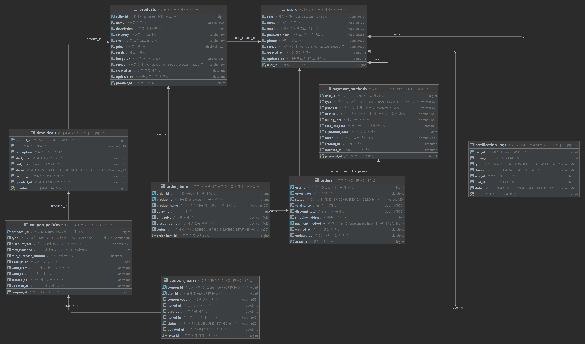

# 𝒕𝒐𝒑𝒂𝒚

"타임 딜 특가 ❗"  
쿠팡을 모티브로 만든 커머스 플랫폼 API 서버 토이 프로젝트입니다.

 

### **📌 MAU 3260만 트래픽을 견디는 쿠팡은 어떻게 만들어진 것일까요?**

- 대규모 트래픽을 고려할 때는 어떤 점을 주의해야 할까요?  
- 대용량 데이터를 고려할 때는 어떤 점을 주의해야 할까요?  
- 위와 같은 궁금증들을 해소하기 위해 직접 쿠팡 서버를 구현해 보는 프로젝트를 진행하게 되었습니다.

 

### **📌 기예를 수련하듯이 다양한 이슈를 고민했습니다!**

- 실제 대규모 커머스에서는 대용량 트래픽을 장애 없이 어떻게 처리하고 있는지
- 단순 테스트 코드 커버리지를 높이는 방식이 아닌 의미 있는 테스트 코드 작성은 무엇인지
- 기술 서적을 통해 접한 객체지향적 이론을 설계로 어떻게 이루어내야 하는지
- 협업하기 좋은 코드를 만들기 위해서는 어떻게 해야 하는지

  

### **📌 이슈 해결 과정**

* 공유 예정 🌱

  

### **📌 서버 구조도**

  

### **📌 할인 이벤트 워크플로우**

  

### **📌 기술 스택**

  

### **📌 ERD (Entity Relationship Diagram)**

  

### **📌 Wiki**

* [Use Case 📄](https://github.com/f-lab-edu/topay/wiki/Use-Case-%F0%9F%93%84)
* [API Endpoint 📄](https://github.com/f-lab-edu/topay/wiki/API-Endpoint-%F0%9F%93%84)

  

### **📌 Git-Flow 브랜치 및 PR 전략**

  
